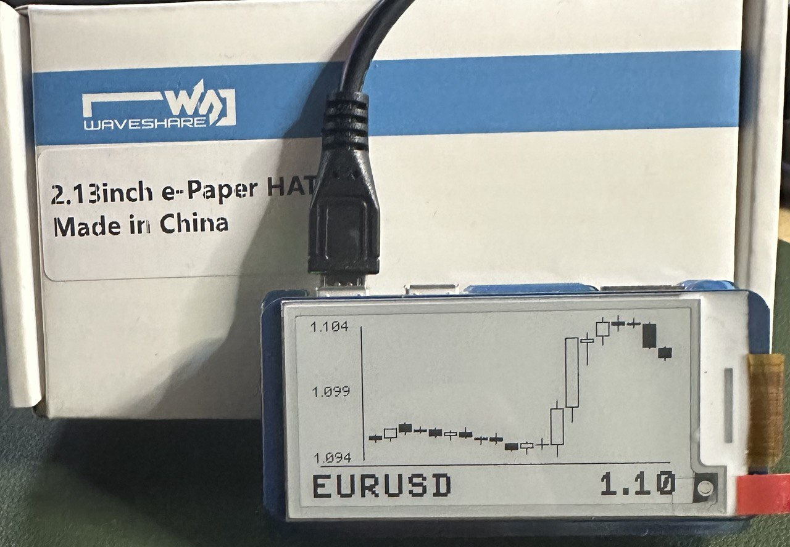

# Zero PriceTicker

Stocks price display for your RPi Zero<br>
Forked from: https://github.com/dr-mod/zero-btc-screen




## Hardware

### Platform

* Raspberry Pi Zero W
* Raspberry Pi 3b+
* Raspberry Pi 4
* Any other modern RPi

### Supported displays

* Waveshare eInk types:
  * epd2in13v2
  * epd2in13v3
* Virtual (picture)

## Installation

1. Turn on SPI via `sudo raspi-config`
    ```
    Interfacing Options -> SPI
   ```
2. Install dependencies
    ```
    sudo apt update
    sudo apt-get install python3-pip python3-pil python3-numpy python3-pandas git
    pip3 install RPi.GPIO spidev yfinance
    sudo apt-get install libatlas-base-dev
    ```

3. Install drivers for your display (you don't need to install both)
    If you have a Waveshare display
    ```
    git clone https://github.com/waveshare/e-Paper.git ~/e-Paper
    pip3 install ~/e-Paper/RaspberryPi_JetsonNano/python/
    ```
4. Download PriceTicker
    ```
    git clone https://github.com/Audiamant/PriceTicker.git ~/PriceTicker
    ```
5. Run it
    ```
    python3 ~/PriceTicker/main.py
    ```

## Screen configuration

Add your Stocks/Cryptos/Currencies like below in the config.cfg file.
You can also change the Display iteration delay and refresh data delay.

```cfg
[base]
console_logs          : false
dummy_data            : false
refresh_display_sek   : 60
refresh_data_min      : 15
#logs_file            : /tmp/zero-btc-screen.log

# Enabled screens or devices
screens : [
#    epd2in13v2
     epd2in13v3
#    epd2in13bv3
#    epd2in7
#    epd3in7
#    picture
#    inkyWhatRBW
  ]

# Configuration per screen
# This doesn't make any effect if screens are not enabled above
[epd2in13v2]
mode : line

[epd2in13v3]
#mode : line
mode  : candle

[epd2in13bv3]
mode  : line

[epd2in7]
mode : candle

[epd3in7]
mode  : candle

[picture]
mode : line
filename : /home/pi/output.png

[inkyWhatRBW]
mode : line

[stocks]
BTC         : BTC-USD
ALGO        : ALGO-USD
#MSCI-WORLD  : EUNL.DE
#APPLE       : APC.F
#GOOGLE      : ABEA.DE
#TESLA       : TL0.DE
#MICROSOFT   : MSF.DE
```

### Autostart

To make it run on startup you can choose from 2 options:

1. Using the rc.local file
    1. `sudo nano /etc/rc.local`
    2. Add one the following before `exit 0`
   ```
   /usr/bin/python3 /home/pi/PriceTicker/main.py &
   ```
   conversely, you can run in `screen` you can install it with `sudo apt-get install screen`
   ```
   su - pi -c "/usr/bin/screen -dm sh -c '/usr/bin/python3 /home/pi/PriceTicker/main.py'"
   ```
   2. Using the system's services daemon
       1. Create a new service configuration file
          ```
           sudo nano /etc/systemd/system/PriceTicker.service
           ```
       2. Copy and paste the following into the service configuration file and change any settings to match your
          environment
          ```
           [Unit]
           Description=PriceTicker
           After=network.target
 
           [Service]
           ExecStart=/usr/bin/python3 -u main.py
           WorkingDirectory=/home/pi/PriceTicker
           StandardOutput=inherit
           StandardError=inherit
           Restart=always
           User=pi
 
           [Install]
           WantedBy=multi-user.target
           ```
       3. Enable the service so that it starts whenever the RPi is rebooted
          ```
           sudo systemctl enable PriceTicker.service
          ```
       4. Start the service and enjoy!
          ```
           sudo systemctl start PriceTicker.service
          ```
       5. RESTART PriceTicker
           ```
           sudo shutdown -r now 
           ```

          If you need to troubleshoot you can use the logging configurations of this program (mentioned below).
          Alternatively, you can check to see if there is any output in the system service logging.
       
           ```
           sudo journalctl -f -u PriceTicker.service
           ```

### Support the project
This projekt ist just a Fork. The heavy work was done by dr-mod so please buy him some coffee.

[](https://www.buymeacoffee.com/drmod)

